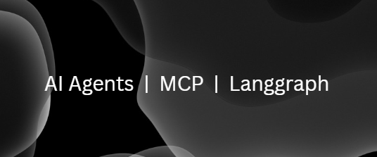

<p align="center">
    
</p>

<p align="center">
  <a href="https://www.linkedin.com/in/suraj-jena-0991a121a/">
    
  </a>
  <a href="https://x.com/jenasuraj_">
    
  </a>
</p>

# <div align="center">🐺 Ai agents with MCP and Langgraph</div>

Welcome to the hub of specialized AI agents. This repository is a cutting-edge demonstration of multi-agent systems, where each agent is a master of its domain. Built on a robust foundation of LangGraph and LangChain and MCP, these agents leverage the Model Context Protocol (MCP) for seamless tool integration and use powerful LLMs via OpenRouter to reason, execute, and deliver intelligent results. From scraping the web and generating podcasts to analyzing stocks and managing GitHub repositories, this project showcases the power of modular, AI-driven automation.

---

## 🧭 Agent Overview

| Agent | Name | Primary Function | Key Tools & APIs |
| :--- | :--- | :--- | :--- |
| **Agent-1** | <a href="https://github.com/jenasuraj/Ai_agents/blob/main/projects/scrapper.py"> **Scrapper Agent**</a> | Intelligent web research & data extraction | Tavily, Firecrawl, OpenWeather |
| **Agent-2** | <a href="https://github.com/jenasuraj/Ai_agents/blob/main/projects/podcast.py"> **Podcast Agent**</a> | Dynamic podcast generation & text-to-speech | ChatGroq, ElevenLabs, Streamlit |
| **Agent-3** | <a href="https://github.com/jenasuraj/Ai_agents/blob/main/projects/stock.py"> **Stock Agent**</a> | Real-time financial market analysis & news | Alpha Vantage, NSE, MoneyControl |
| **Agent-4** | <a href="https://github.com/jenasuraj/Ai_agents/blob/main/projects/github_agent.py"> **Github Agent**</a> | Automated repository management & documentation | GitHub API, MCP SDK, PyGithub |
| **Agent-5** | <a href="https://github.com/jenasuraj/Ai_agents/blob/main/projects/notion_agent.py">**Notion Copilot**</a> | Research, content structuring & Notion automation | Notion API, Tavily, Firecrawl |
| **Agent-6** | <a href="https://github.com/jenasuraj/Ai_agents/blob/main/projects/deep_research.py"> **Deep research Agent**</a> | Intelligent deep research  | Tavily, Firecrawl |
| **Agent-7** | <a href="https://github.com/jenasuraj/Ai_agents/blob/main/projects/rag.py"> **RAG**</a> | RAG retrieval  | Huggingface |

</br>
</br>


## Scrapper Agent (Agent-1)
Scrapper Agent (Agent-1) is an intelligent assistant that can search the web, scrape detailed content from URLs, and fetch real-time weather information. It uses a reasoning agent to decide which tool to call, providing accurate and structured responses to user queries.

## ✨Features
- **Web Search (Tavily API)** → Finds relevant URLs for queries
- **Content Scraping (Firecrawl API)** → Extracts detailed content (Markdown/HTML) from URLs
- **Weather Lookup (OpenWeather API)** → Provides real-time temperature for any city
- **Reasoning Agent** → Uses `create_react_agent` to choose the right tool automatically

</br>

## Podcast Agent (Agent-2)
AuralAI is an AI-powered podcast agent that can generate engaging podcasts on any topic. It orchestrates conversations between a host (podcaster) and a guest using LLMs and converts the conversation into lifelike audio using ElevenLabs TTS.

## ✨Features
- **Dynamic Podcast Generation** → Creates structured conversations between host and guest based on user input
- **Short, Engaging Dialogue** → Limits content to 150–250 words for concise podcasts
- **Humor & Personality** → Adds personality and humor in the conversation
- **Text-to-Speech (ElevenLabs)** → Converts podcaster and guest text into high-quality audio
- **Streamlit UI** → Allows users to input a podcast topic and play generated audio

</br>

## Stock Agent (Agent-3)
Stock Agent (Agent-3) is an AI-powered financial assistant that provides real-time and historical stock market data, financial news, and community sentiment analysis. It integrates multiple APIs and scraping tools to deliver structured insights and uses a reasoning agent to decide the best data source for a given query.

## ✨Features
- **Market Data (Alpha Vantage API)** → Fetches stock prices, indicators, and company data
- **Indian Market Data (NSE / MoneyControl via Firecrawl)** → Provides stock and index data from Indian markets
- **Financial News ( Firecrawl)** → Extracts news articles and performs sentiment analysis
- **Reasoning Agent** → Uses `create_react_agent` to automatically decide whether to pull data from markets, news, or social sentiment

</br>

## GitHub Agent (Agent-4)
GitHub Agent (Agent-4) is an AI-powered assistant that can interact with GitHub repositories using Model Context Protocol (MCP). It can read, analyze, and update repository files, particularly focusing on maintaining and improving README.md documentation.

## ✨Features
- **Repository Access (MCP)** → Connects to GitHub repositories via Model Context Protocol
- **File Reading & Analysis** → Examines repository structure and existing documentation
- **README Management** → Updates, enhances, and maintains README.md files
- **Content Generation** → Creates comprehensive documentation based on code analysis
- **Version Control Integration** → Commits changes with meaningful messages


</br>

## Notion Copilot (Agent-5)
A sophisticated dual-agent system that acts as your research assistant and Notion database manager. It seamlessly researches topics and automatically structures & saves results to your Notion workspace.

## ✨Features
- **Dual-Agent Architecture** → Intelligent routing between research and Notion specialists
- **Smart Research** → Uses Tavily and Firecrawl for real-time web data
- **Automated Notion Integration** → Formats any content into perfectly structured Notion blocks
- **MCP Server** → Implements Model Context Protocol for clean tool management
- **Conversational UI** → Interact naturally through a simple chat interface


</br>


## Deep Research Agent (Agent-6)
An advanced research assistant that performs deep web research, scrapes high-quality content, and delivers a structured, actionable output.

## ✨Features
- **Deep Research Capability** → Automatically searches and scrapes data from multiple sources  
- **Automated URL Scraping** → Dynamically calls the scraper tool for each discovered URL  
- **Structured Final Output** → Produces a clean, well-organized result for easy consumption  
- **Prompt-Centric Architecture** → Fully driven by prompt instructions for flexibility  

</br>


## RAG (Agent-7)
This is a simple project, demonstrating how rag works in langchain / langgraph.

## ✨Features
- **Docs/url splitting** → you can provide urls / pdfs / text base 
- **rag retrieval** → connect your llm with vector store to unlock rag !  


</br>
</br>

## 🛠 Installation 
---
### 1. Clone the Repository
```bash
git clone git@github.com:jenasuraj/Ai_agents.git
```
### 2. Go to projects
```bash
cd projects
```
### 3. Create a virtual env
```bash
python -m venv venv
```
### 4. activate it
```bash
venv\Scripts\Activate
```
### 5. Install the requirements.txt
```bash
pip install -r requirements.txt
```
### 6. Run any agent !
```bash
Run python ___.py
```

Now in order to run and install mcp, do the same procedure, but i would suggest you to use uv for installation ⬇️🤗.
<a href="https://www.linkedin.com/in/suraj-jena-0991a121a/">
    
  </a>
  <a href="https://x.com/jenasuraj_">
    
</a>


